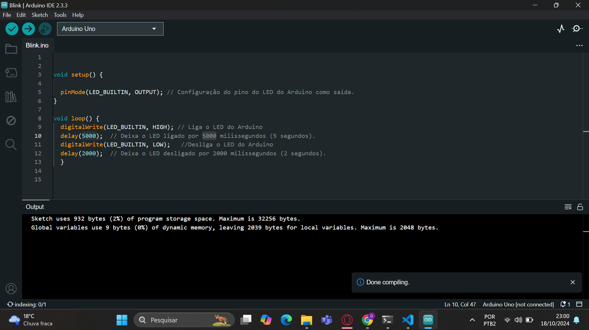
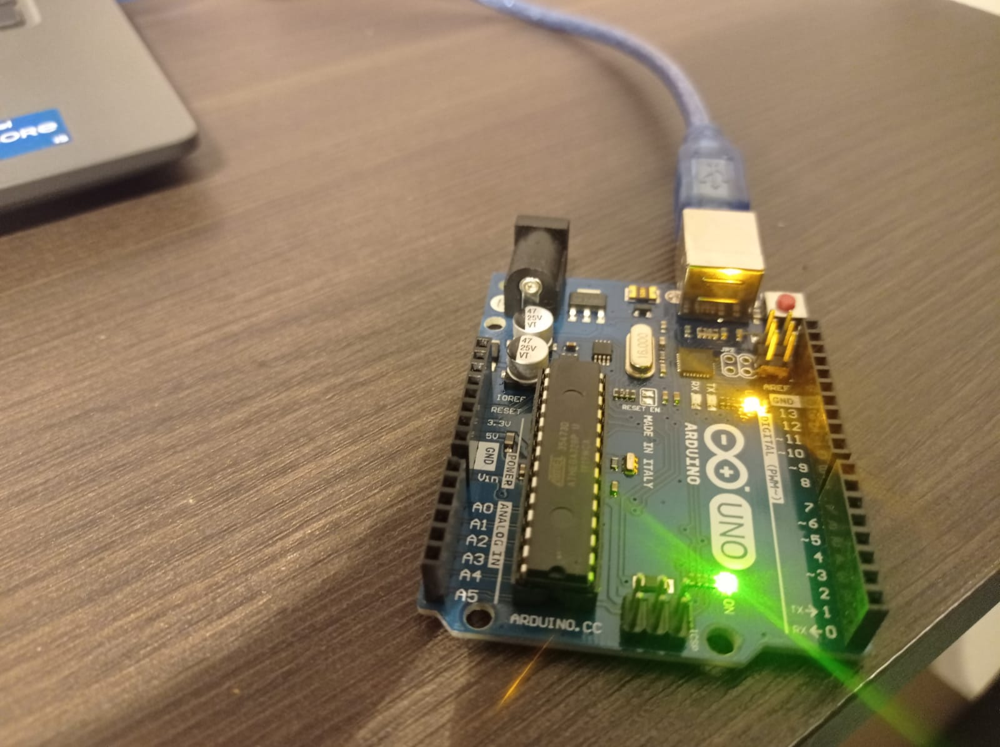
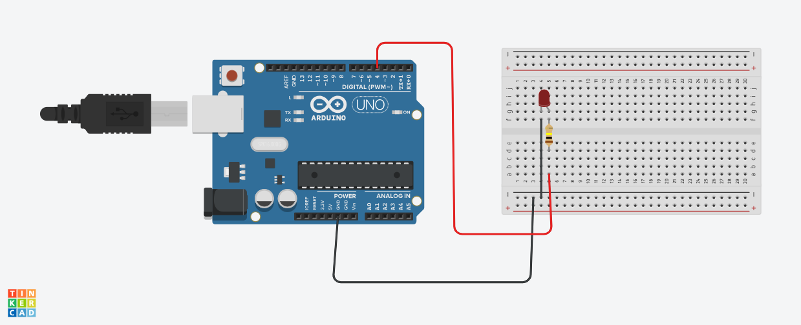
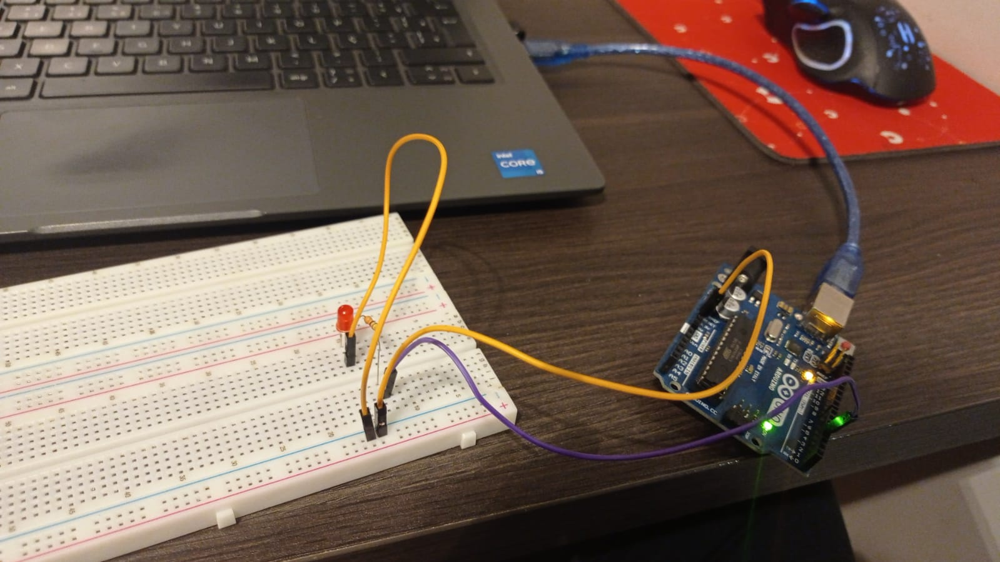

# Projeto que visa demonstrar um pisca pisca em uma placa de arduíno.

## Parte 1: Blink Led Interno

Desenvolvimento de um código que permite o LED de uma placa Arduino piscar durante 5 segundos e ter uma pausa de 2 segundo.

### 1.1 Código do blink

### 1.2 Imagem do Arduino rodando o código blink

### 1.3 Video do Arduino rodando o código blink
Link: https://youtu.be/eUbNj2brhYU

## Parte 2: Simulando Blink Externo

### 2.1 Circuito no Tinkercard

### 2.2 Link do Circuito

Link do Circuito no Tinkercard: https://www.tinkercad.com/things/1EHApGqCirf-ponderadaprog1/editel?returnTo=https%3A%2F%2Fwww.tinkercad.com%2Fdashboard%2Fdesigns%2Fcircuits&sharecode=UjclUwBUGJ510fjELabScPHJCtodOiDXrK77R2m63_0 

### 2.3 Montando o Circuito Blink na protoboard

